<h2 align="center">About me 🧙</h2>

 

I am a PhD student at Safran Data Systems and Lab-STICC, France.

<!--  -->

<h2 align="center">Tools I've used at some point 🖥️</h2>

Here is a list (hypothetically exhaustive) of all  the technologies I've used for projects  

<!-- 

## Dynamically generated GitHub infos

 -->

<!---

--->

<!-- ---

 -->

